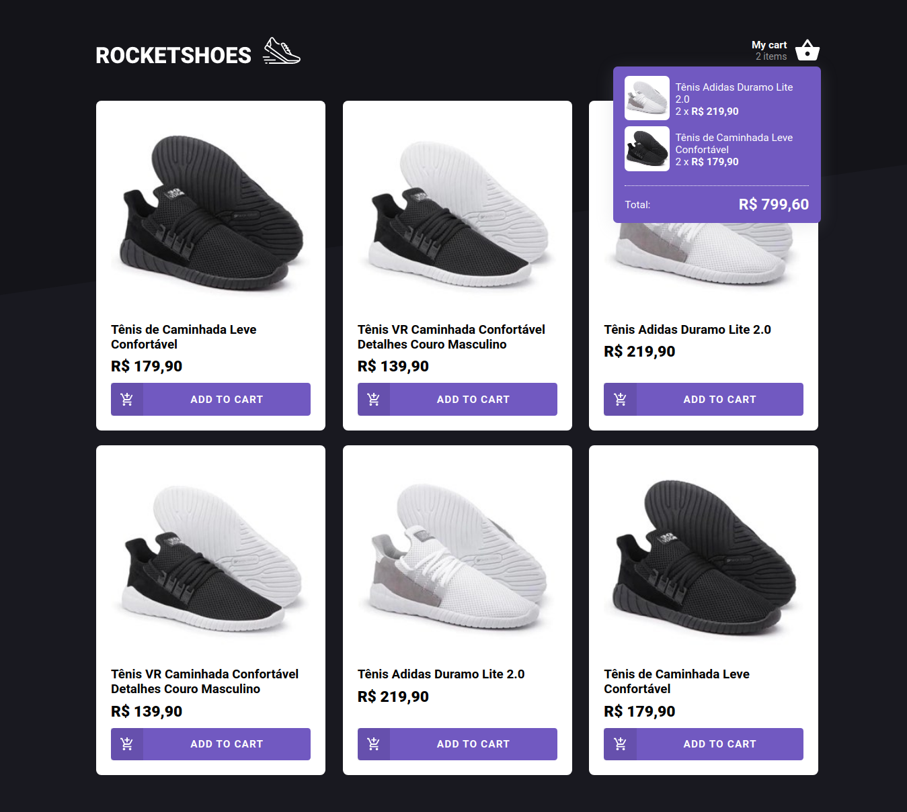

<div align='center'>
  
</div>

<div align='center'>
  <h1 align='center' >
    
  </h1>
 </div>

<h4 align="center">
  A kind-of ecommerce website built with the purpose of learning Zustand (a state-management library for React)
</h4>

<p align="center">
  
</p>

<p align="center">
  <a href="#technologies">Used Technologies</a>&nbsp;&nbsp;&nbsp;|&nbsp;&nbsp;&nbsp;
  <a href="#how-to-run">How to run</a>
</p>

<div>
  
</div>

<h2 id="techonologies" name="technologies">
  :rocket: Used Technologies
</h2>

- [Next.js](https://nextjs.org/)- Next.js is a framework built on top of React.
- [TypeScript](https://www.typescriptlang.org/) - Typescript is a superset of the common JavaScript. With that, we can type and maintain our code easier.
- [Styled Components](https://styled-components.com/) - Styled components is a CSS-in-JS library.
- [Zustand](https://github.com/pmndrs/zustand) - A library for state management in React applications
- [React Testing Library](https://testing-library.com/) - React Testing Library is a library that allows us to create unit and integration tests of React components.
- [ESLint](https://eslint.org/) and [Prettier](https://prettier.io/) - With ESLint and Prettier, we can improve our code quality by linting and auto formating it.

<h2 id="how-to-run" name="how-to-run">
  :arrow_forward: How to run
</h2>

### First steps

If you want to run the application in your computer, follow these steps;
First of all, you'll need to clone the repository and install the dependencies. Assuming you have [Yarn](https://yarnpkg.com/) installed in your computer, follow the steps bellow:

```
# Clone the repo
$ git clone https://github.com/TiagoDiass/rocketshoes-zustand.git

# Enter the repo's folder
$ cd rocketshoes-zustand

# Install the dependencies
$ yarn install

# Start the application
$ yarn dev

# Start the fake server (you'll have to do that in another terminal tab or terminal itself)
$ yarn start:api
```

After following these steps, the terminal will show you in which port it's running, it's on the port 3000 usually, so, you'll just need to enter in your browser and
type `localhost:3000`, then you'll be able to check the app running. When you want to stop it, go to the terminal that you used to start the app, and type <kbd>CTRL</kbd>+<kbd>C</kbd>,
this way you'll stop the app

---

Hope you enjoyed this project :smiley:<br>
:wave: [Get in touch!](https://www.linkedin.com/in/tiagodiass)

### Author: [Tiago Dias](https://tiagodiass.github.io)
